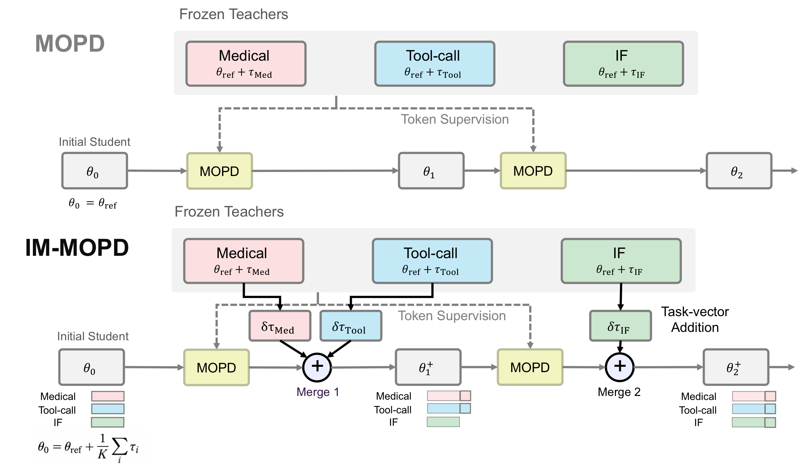

# IM-MOPD

Code for *No Pain, More Gain: Iterative Merging for Effective Multi-Teacher On-Policy Distillation*
([arXiv:2609.34745](https://arxiv.org/abs/2609.34745)).

IM-MOPD initializes the student with a uniform merge of the teacher task vectors and, during multi-teacher
on-policy distillation (MOPD), adds the task vectors of the domains whose validation recovery is still at or
below a threshold.

<p align="center"></p>

## Results

| Qwen3-4B | MedQA | CaseHOLD | FinQA | IFBench | τ² | Norm. |
|---|---:|---:|---:|---:|---:|---:|
| Base | 69.5 | 61.8 | 59.1 | 24.9 | 5.3 | 0.0 |
| Teachers | 80.7 | 73.4 | 75.0 | 59.4 | 66.7 | 100.0 |
| MOPD | 69.1 | 64.7 | 74.3 | 56.9 | 7.9 | 42.8 |
| SFT Warm-up + MOPD | 73.9 | 68.2 | 71.1 | 53.4 | 31.6 | 59.0 |
| Uniform Merge + MOPD | 72.7 | 67.6 | 74.7 | 53.6 | 11.4 | 53.8 |
| IM-MOPD | 76.6 | 70.9 | 74.0 | 57.8 | 69.3 | 86.9 |

| Qwen3-1.7B | MedQA | CaseHOLD | FinQA | IFBench | τ² | Norm. |
|---|---:|---:|---:|---:|---:|---:|
| Base | 44.1 | 44.6 | 42.4 | 18.4 | 7.9 | 0.0 |
| Teachers | 58.5 | 69.6 | 62.4 | 46.4 | 28.1 | 100.0 |
| MOPD | 49.0 | 52.2 | 59.1 | 36.8 | 0.0 | 34.9 |
| SFT Warm-up + MOPD | 52.7 | 56.6 | 54.8 | 32.6 | 10.5 | 46.5 |
| Uniform Merge + MOPD | 51.2 | 59.9 | 58.6 | 34.6 | 4.4 | 46.3 |
| IM-MOPD | 53.7 | 59.4 | 55.9 | 42.9 | 28.1 | 76.0 |

pass@1 for τ² (Tool Use) and avg@3 for the other benchmarks. Norm. is the average normalized score.

## Layout

```
immopd/
├── merging/     task_vector.py  merge_teachers.py  recovery.py        task vectors, merge rule
├── distill/     train_mopd.py  train_immopd.py  merge_callback.py     MOPD and IM-MOPD
│                driver.py  serve_teachers.py  trainer.py  loss.py
├── training/    train_sft.py  gen_teacher.py  filter_samples.py       reference models, teachers,
│                tau2_filter.py  rl_nemo/                              SFT warm-up
├── data/        download.py  prep_pools.py  prep_tau2.py              data preparation
│                prep_openthoughts3.py  build_warmup_mix.py
├── eval/        run_all.py  benchmarks.py  tau2_run.py                evaluation, validation,
│                validation.py  prefix/                                prefix continuation
└── common/      config.py  chat.py  resume.py
configs/         sft/  rl/  mopd/  immopd/  accelerate/
scripts/         one launcher per stage
data/            validation set, IFEval / IFBench prompts, tau2 tool schemas
analysis/        data and scripts of the tables and figures
docs/            REPRODUCE.md
tests/           CPU tests
third_party/     instruction-following checkers
```

## Installation

```bash
pip install -r requirements.txt && pip install -e . --no-deps
export MODEL_DIR=/path/to/models DATA_DIR=/path/to/data RUN_DIR=/path/to/runs
```

tau2-bench runs in its own environment:

```bash
python -m venv /path/to/tau2 && /path/to/tau2/bin/pip install pyyaml \
    "tau2-bench @ git+https://github.com/sierra-research/tau2-bench@v1.0.1"
export TAU2_PYTHON=/path/to/tau2/bin/python OPENAI_API_KEY=...
```

## Usage

```bash
scripts/merge_init.sh $MODEL_DIR/merge-4b-uniform tau=0.2,med=0.2,law=0.2,fin=0.2,if=0.2
GPUS=0-7  scripts/serve_teachers.sh 4b
GPUS=8-15 scripts/train_immopd.sh configs/immopd/qwen3-4b.yaml
GPUS=8-15 scripts/eval.sh      $RUN_DIR/immopd/qwen3-4b/checkpoint-100 $RUN_DIR/eval/immopd-4b
GPUS=8-15 scripts/eval_tau2.sh $RUN_DIR/immopd/qwen3-4b/checkpoint-100 $RUN_DIR/eval/tau2-immopd-4b
```

[docs/REPRODUCE.md](docs/REPRODUCE.md) lists the commands for every stage, table and figure.

## Citation

```bibtex
@article{kim2026immopd,
  title   = {No Pain, More Gain: Iterative Merging for Effective Multi-Teacher On-Policy Distillation},
  author  = {Kim, Seonghyeon and Jang, Chaeyun and Lee, Noah and Kim, Boseop and Lee, Juho},
  journal = {arXiv preprint arXiv:2609.34745},
  year    = {2026}
}
```

## License

Apache-2.0. Code under `third_party/` keeps its upstream license.
